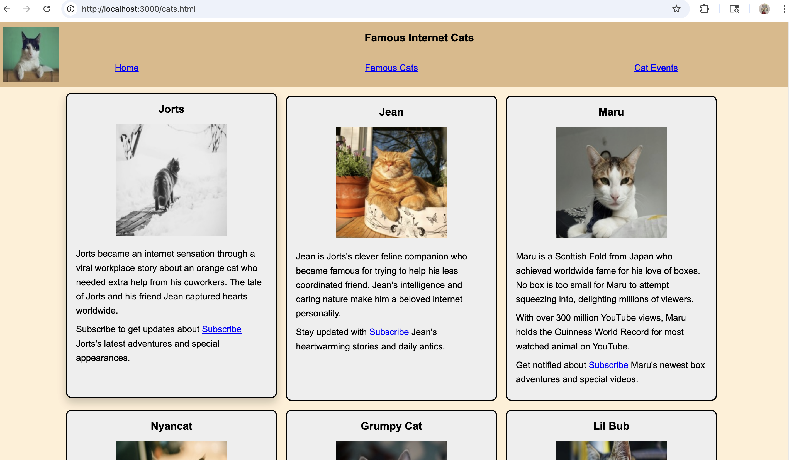
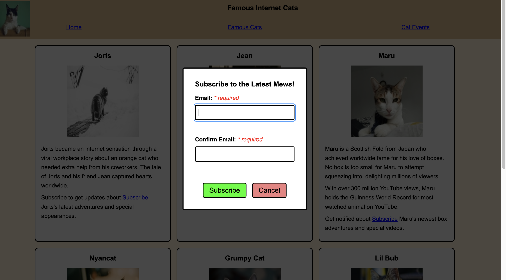
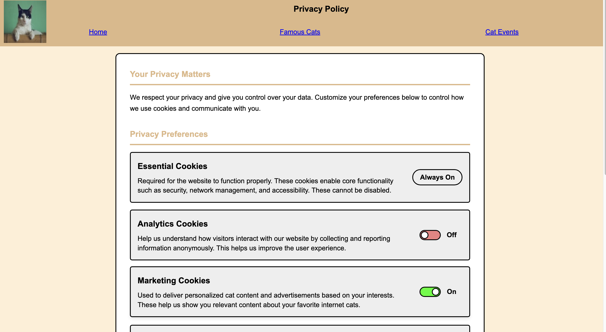

# Cats Power the Internet 🐱

An interactive website celebrating famous internet cats with advanced JavaScript functionality including modal dialogs, form validation, accordion components, and privacy preference management.

## 📋 Project Overview

"Cats Power the Internet" is a feature-rich web application showcasing famous internet cats like Jorts, Jean, Maru, Nyancat, Grumpy Cat, and Lil Bub. The site demonstrates modern web development practices with vanilla JavaScript, semantic HTML, and responsive CSS design.

## ✨ Key Features

### 🎯 Advanced JavaScript Functionality
- **Modal Dialog System**: Custom subscription modal with form validation
- **Real-time Form Validation**: Email and confirmation email validation with error messaging
- **Accordion Components**: Expandable/collapsible event information sections
- **State Management**: True state-render cycle implementation for privacy preferences
- **Event Delegation**: Efficient event handling for dynamic content
- **Hamburger Menu**: Responsive navigation with accessibility features

### 🎨 User Interface Components
- **Privacy Preferences Toggle**: Interactive cookie and newsletter preference controls
- **Subscribe Forms**: Email subscription with validation and error handling
- **Responsive Navigation**: Mobile-friendly hamburger menu with ARIA support
- **Accordion Panels**: Collapsible event information sections
- **Card-based Layout**: Visual presentation of famous internet cats

### ♿ Accessibility Features
- ARIA labels and roles throughout
- Keyboard navigation support
- Focus management for modals and menus
- Skip-to-content links
- Screen reader friendly error messages
- Semantic HTML5 structure

## 🛠️ Technologies Used

- **Frontend**: HTML5, CSS3, Vanilla JavaScript (ES6+)
- **Backend**: Node.js, Express.js
- **Design**: Mobile-first responsive design
- **Accessibility**: WCAG 2.1 compliant

## 📁 Project Structure

```
cats-power-internet/
├── public/
│   ├── images/
│   │   ├── logo.png
│   │   ├── kittens-group.png
│   │   ├── cat-snow.png
│   │   ├── cat-orange.png
│   │   ├── kitten-small.png
│   │   ├── kitten-carpet.png
│   │   ├── kitten-fluffy.png
│   │   └── kitten-ornament.png
│   ├── index.html
│   ├── cats.html
│   ├── events.html
│   ├── privacy.html
│   ├── styles.css
│   └── scripts.js
├── server.js
├── package.json
├── licenses.txt
└── README.md
```

## 🚀 Getting Started

### Prerequisites

- Node.js (v14 or higher)
- npm (Node Package Manager)

### Installation

1. Clone the repository:
```bash
git clone https://github.com/kneha07/Cats-Power-the-Internet-.git
cd Cats-Power-the-Internet-
```

2. Install dependencies:
```bash
npm install
```

3. Start the server:
```bash
node server.js
```

4. Open your browser and navigate to:
```
http://localhost:3000
```

## 💻 JavaScript Features Breakdown

### 1. Hamburger Menu (All Pages)
```javascript
// Responsive navigation with:
- Toggle visibility on mobile devices
- ARIA expanded states
- Tabindex management for accessibility
- Window resize handling
```

### 2. Modal Dialog System (cats.html)
```javascript
// Features:
- Open/close modal functionality
- Form validation on submit
- Real-time input validation
- Error message display
- Form reset on modal close
```

### 3. Form Validation (cats.html)
```javascript
// Validates:
- Email format (must include @)
- Email confirmation matching
- Required field checking
- Real-time error feedback
- Error styling and messaging
```

### 4. Accordion Component (events.html)
```javascript
// Functionality:
- Expand/collapse content sections
- ARIA expanded states
- Independent panel control
- Keyboard accessible
```

### 5. Privacy Preferences (privacy.html)
```javascript
// State-Render Cycle Implementation:
- Centralized state management
- Pure render function
- Event delegation
- Dynamic HTML generation
- Real-time preference updates
```

## 📱 Pages Overview

### Home (`index.html`)
Landing page featuring an introduction to internet cats with image panels and descriptive content.

### Famous Cats (`cats.html`)
Gallery of famous internet cats with individual subscribe buttons that trigger a modal dialog with email validation.

### Cat Events (`events.html`)
Upcoming cat-related events displayed in an accordion format with expandable details for each event.

### Privacy Policy (`privacy.html`)
Interactive privacy preferences page with toggle switches for analytics, marketing, and newsletter settings using state-driven rendering.

## 🎨 CSS Features

- **Responsive Grid Layouts**: Flexible card-based designs
- **Mobile-First Approach**: Optimized for all screen sizes
- **Custom Toggle Switches**: Styled preference controls
- **Modal Overlays**: Professional dialog styling
- **Accordion Animations**: Smooth expand/collapse transitions
- **Hamburger Menu**: Animated mobile navigation

## 🔧 Form Processing

The application includes Express middleware for handling form submissions:

```javascript
// POST endpoint for subscription form
app.post('/subscribe', express.urlencoded({extended: false}), (req, res) => {
  // Processes form data and displays results
});
```

## ♿ Accessibility Highlights

- **Skip Links**: Direct navigation to main content
- **ARIA Labels**: Descriptive labels for screen readers
- **Focus Management**: Proper tab order and focus indicators
- **Error Messaging**: Clear, accessible validation feedback
- **Keyboard Navigation**: Full keyboard support for all interactions
- **Semantic HTML**: Proper heading hierarchy and landmark regions

## 📸 Screenshots

### Homepage


### Famous Cats Gallery


### Subscription Modal


### Cat Events Accordion


### Privacy Preferences


## 🔮 Future Enhancements

- Backend database integration for storing subscriptions
- User authentication system
- Cat photo upload feature
- Social media integration
- Comments and ratings system
- Email notification system
- Advanced filtering and search
- Admin dashboard

## 📝 License

This project uses images from Unsplash under the [Unsplash License](https://unsplash.com/license).

See `licenses.txt` for detailed image attribution.

## 👤 Author

**Neha**
- GitHub: [@kneha07](https://github.com/kneha07)
- LinkedIn: [Neha K](https://www.linkedin.com/in/kneha101n/)

## 🙏 Acknowledgments

- Cat images provided by [Unsplash](https://unsplash.com)
- Inspired by famous internet cats and their human companions
- Built with vanilla JavaScript to demonstrate core web development skills
- Accessibility best practices from WCAG guidelines

## 🐾 Contributing

Contributions, issues, and feature requests are welcome! Feel free to check the issues page if you want to contribute.

---

⭐ Star this repository if you love cats and clean JavaScript code!